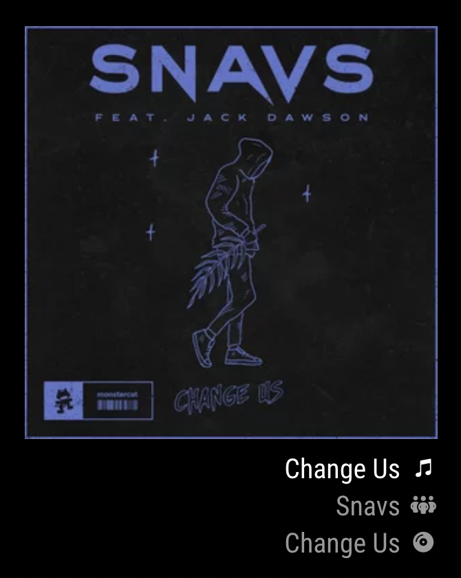

# MMM-Lastfm

A module for [MagicMirror²](https://github.com/MichMich/MagicMirror) that displays the [Last.fm](https://www.last.fm/) scrobble currently playing.

## Installation

Just navigate to the `modules` directory of your MagicMirror² installation and clone this repository.

```sh
git clone https://github.com/RineshRamadhin/MMM-Lastfm.git
```

## Prerequisites

### Last.fm API key

To access the Last.fm API you'll need to create an account on [Last.fm](https://www.last.fm/join).
Then [Create a new API account](https://www.last.fm/api/account/create). Make sure you don't reuse this API account for other purposes due to [rate limitations](#api-rate-limits).
Fill in the required fields (you can leave `Callback URL` and `Application homepage` empty) and hit save.
Then copy the `apiKey` for your config. you can find an overview of API accounts and `apikey` on [the API accounts page](https://www.last.fm/api/accounts).

## Configuration

**Example:**

```js
{
  module: "MMM-Lastfm",
  position: "top_left",
  header: "Now listening on Last.fm",
  config: {
    apiKey: "LASTFM_API_KEY",
    username: "LASTFM_USERNAME",
  }
},
```

### Configuration Options

| **Option**        | **Type**   | **Default**    | **Description**                                                                                                |
| ----------------- | ---------- | -------------- | -------------------------------------------------------------------------------------------------------------- |
| `layout`          | `string`   | `standard`     | Which layout to use. Left/right alignment will happen automatically. Possible options: [`standard`, `row`]     |
| `loadingText`     | `string`   | `Loading...`   | The loading text to show while waiting for the first response from Last.fm                                     |
| `apiKey`          | `string`   | ``             | The Last.fm API key. See the [Last.fm API key](#lastfm-api-key) section for more info.                         |
| `username`        | `string`   | ``             | The Last.fm username. See the [User-privacy](#user-privacy) section for more info.                             |
| `activeInterval`  | `integer`  | `10`           | How often to check for updates when listening to a song in seconds. This should be at least 10 seconds.        |
| `passiveInterval` | `integer`  | `60`           | How often to check for updates when not listening to a song in seconds. This should be at least 10 seconds.    |
| `passiveCount`    | `integer`  | `5`            | How many times to stay in `active` mode after you stop listening to songs before switching to `passive` mode.  |
| `animationSpeed`  | `integer`  | `1000`         | The fade effect speed between songs and showing / hiding the module in ms.                                     |
| `textLength`      | `integer`  | `30`           | The maximum text length before cutting off. Does not apply for the `row` layout.                               |

### API rate limits
Last.fm makes use of a fair use policy when it comes to API rate limits. In order to reduce the API calls made to Last.fm this module will try to combine API calls as much as possible. When two or more instances of the module are shown on a page, or multiple screens are used, behind the scenes a single fetcher will be used to retrieve data from Last.fm. Fetchers will be reused when instances have the following identical config options: `apiKey`, `username`, `activeInterval`, `passiveInterval` and `passiveCount`.

### User privacy
In order to retrieve the Last.fm userdata your/their profile must have recent listening information public. This is required even if the API account is for your own personal account. 
You can check and update this setting on the [Privacy](https://www.last.fm/settings/privacy) page. Uncheck the `Hide recent listening information` option and hit save.

## Screenshots

Default layout (left)          |  Default layout (right)
:-----------------------------:|:-----------------------------:
 |
Row layout (left)              |  Row layout (right)
     |
